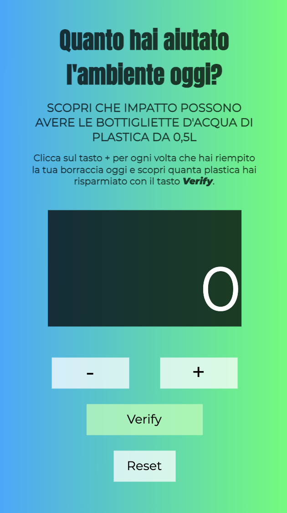

# Project JS-Basic Francesco Immacolato

## Contents
1. [General Info](#general-info)
2. [Built with](#built-with)
3. [Technologies](#technologies)
4. [Contact](#contact)

***
### General Info
Un piccolo counter realizzato in JS per tenere conto di quanta plastica si risparmia ogni volta che si riempie e riutilizza una borraccia anzichè una bottiglietta di plastica.

#### Prova qui l'applicazione
https://counter-save-plastic-immacolato.netlify.app

### Screenshot

***
## Built with
* [JavaScript]

***
## Technologies
Per realizzare questo progetto ho utilizzato:
* [Atom](https://atom.io): Version 1.58.0
* [GitHub](https://github.com)
* [Netlify](https://www.netlify.com)

***
## Contact
* Francesco Immacolato - francesco.immacolato@gmail.com
* Link al progetto su Netlify:
* Link GitHub: https://github.com/Francesco-Imm/javascriptbasic.git
